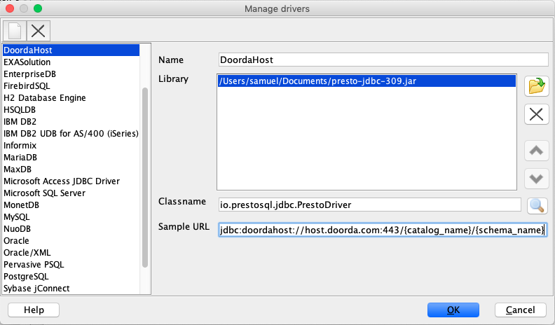
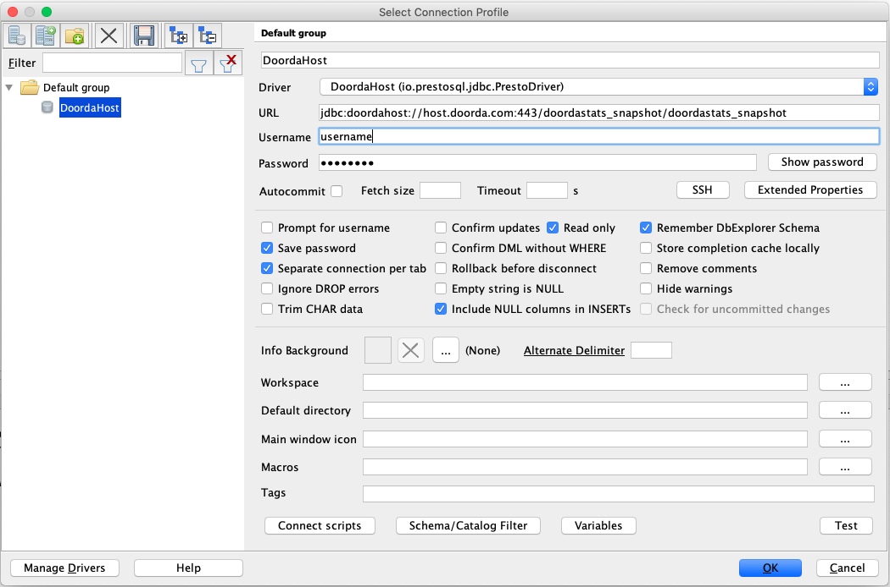
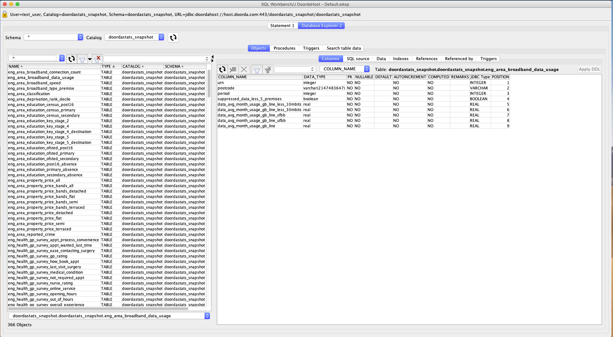
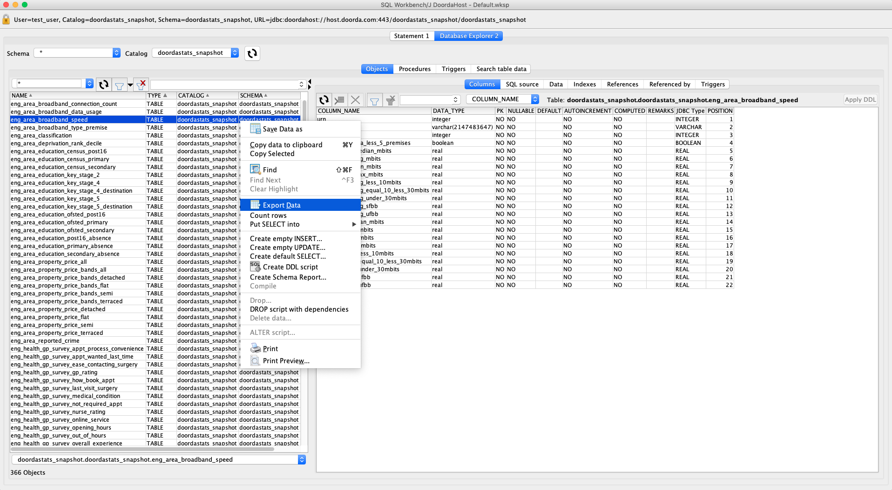
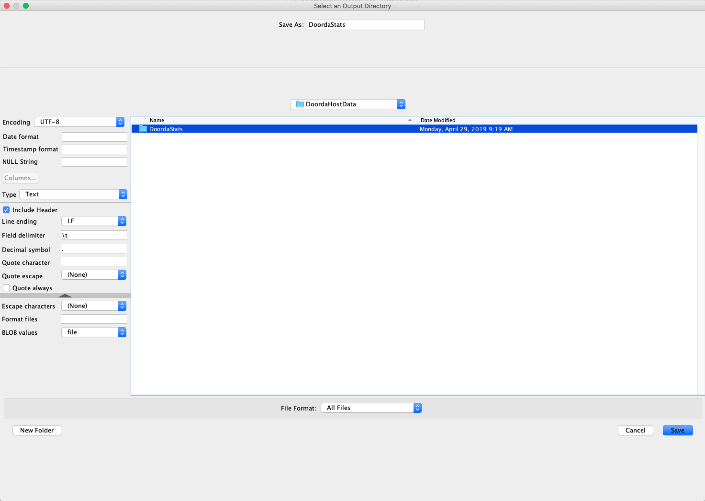
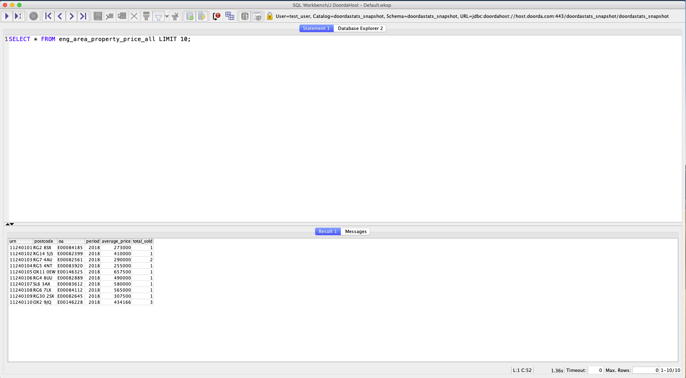
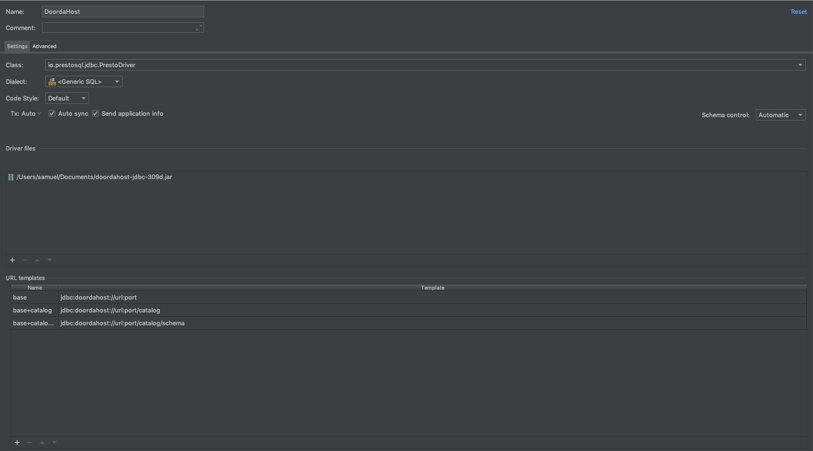
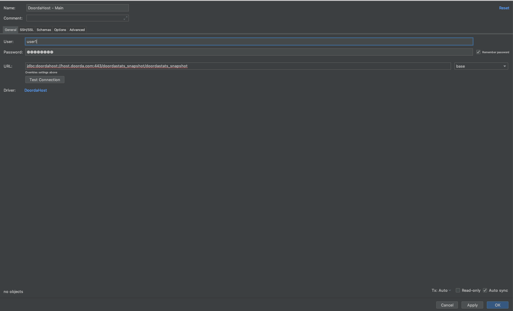

# Database Clients

## SQLWorkbenchJ
SQL Workbench/J is a free, DBMS-independent, cross-platform SQL query tool. It is written in Java and should run on any operating system that provides a Java Runtime Environment. Its main focus is on running SQL scripts (either interactively or as a batch) and export/import features.

### Download
1) Installer
    Download latest SQLWorkbench/J installer from [here](http://www.sql-workbench.net/downloads.html)

    Follow the instructions in [Guide](http://www.sql-workbench.net/manual/install.html)

2) DoordaHost JDBC Connector from [here](https://github.com/Doorda/drivers-cli/raw/master/doordahost/jdbc/DoordaHostJDBC_309d.jar)

### Requirements
Java 7 or higher

### Steps

1) Add JDBC Drivers

    Select `File` at the top menu and client on `Manage Drivers`
    
    
    
    Edit form with:  
    >Name: `DoordaHost`  
    >Library: Path to Downloaded JDBC driver  
    >Classname: `io.prestosql.jdbc.PrestoDriver`  
    >Sample URL: `jdbc:doordahost://host.doorda.com:443/{catalog_name}/{schema_name}`  

2) Connect to DoordaHost

    Select `File` at the top menu and click `Connect window`. 
    
    
    
    Edit form with:
    
    >Name: `name of connection`  
    >Driver: `DoordaHost`  
    >URL: modify `{catalog_name}` and `{schema_name}`  
    >Username: (Included in your welcome email)   
    >Password: (Included in your welcome email)   
    >Read Only: True  
    
    Click on `Test` at the bottom right corner of the window. 
    
    If connection is successful, click `Ok`. 

3) Issue Query/Preview Data/Export Data

    You can either select a table on the left to preview schema and data, execute a query or export data into a text file.
    
    
    
    To Export data:
    
    Left click on the table and click on `Export Data`
    
    
    
    Then select the settings (Delimiter, Quote character, Header etc) for the file and select the Output Directory. 
    
    
    
    To execute a query:
    
    Move to the `Statement` panel and fill in the query to be executed. Then `Ctrl + Enter` to run the query.
    
    

## Jetbrains DataGrip

### Download

#### JDBC Driver
1) DoordaHost JDBC Connector from [here](https://github.com/Doorda/drivers-cli/raw/master/doordahost/jdbc/DoordaHostJDBC_309d.jar)

### Steps

1) Add Driver

    
    
    Edit form with:  
    >Name: `DoordaHost`
    >Driver Files: Path to Downloaded JDBC driver (doordahost-jdbc-xxx.jar)  
    >Class: `io.prestosql.jdbc.PrestoDriver`  
    >URL Templates:   
    >>`jdbc:doordahost://url:port`  
    >>`jdbc:doordahost://url:port/catalog`  
    >>`jdbc:doordahost://url:port/catalog/schema`  

2) Connect to DoordaHost

    
    
    Edit form with:
    >Name: `name of connection`  
    >Driver: `DoordaHost`  
    >URL: modify `jdbc:doordahost://host.doorda.com:443/{catalog}/{schema}`replace catalog and/or schema.  
    >Username: (Included in your welcome email)   
    >Password: (Included in your welcome email)   
    
    Click on `Test` at the bottom right corner of the window.   
    If connection is successful, click `Ok`.  

Back to [List of Tools](README.md#list-of-supported-tools)