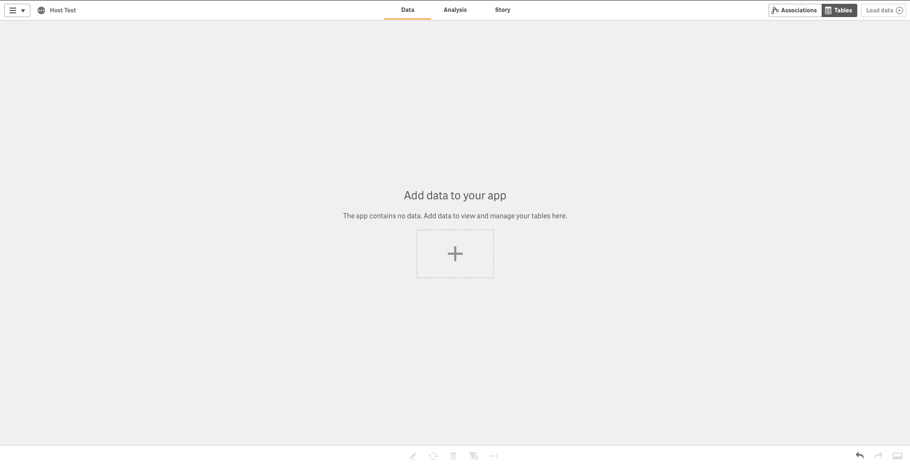
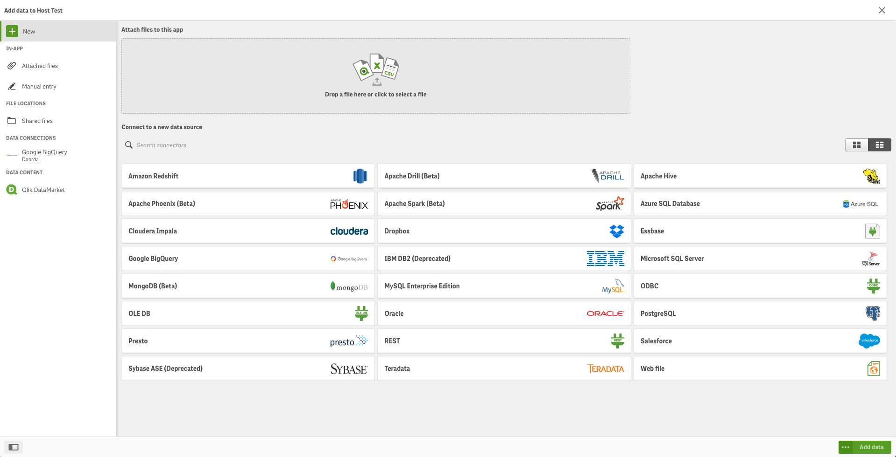
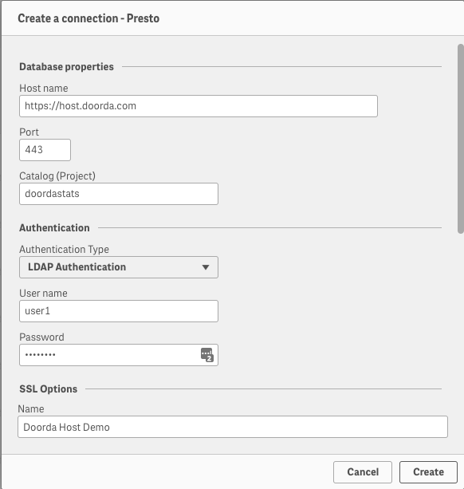
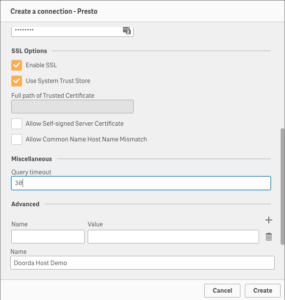

#

## Qlik Sense

### Usage
1) In your app, go to *`Data Manager`*

2) Click on `Presto`

3) Enter these fields:

>Host name: https://host.doorda.com  
>Port: 443  
>Catalog (Project): (see [here](../terms/README.md#terms) for list of Catalogs)    
>Authentication Type: LDAP Authentication   
>User name: (Included in your welcome email)   
>Password: (Included in your welcome email)   
>SSL Options:   
>>Enable SSL: True  
>>Use System Trust Store: True  

Back to [List of Tools](README.md#list-of-supported-tools)