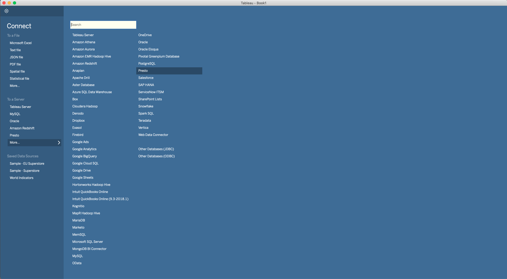
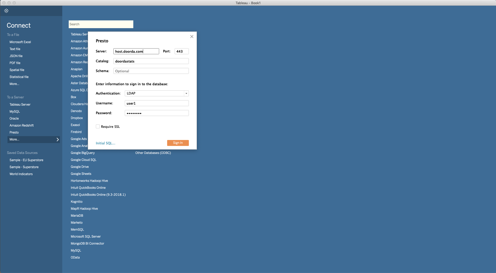

# Tableau

## Usage

1) Select `Presto` Connection

2) Enter these fields:

>Server: host.doorda.com  
>Port: 443  
>Catalog: (see [here](../terms/README.md#terms) for list of Catalogs)  
>Schema (optional):  (see [here](../terms/README.md#terms) for list of Schemas)  
>Authentication: LDAP  
>User name: (Included in your welcome email)   
>Password: (Included in your welcome email)   
>Require SSL: True  
 

Back to [List of Tools](README.md#list-of-supported-tools)
